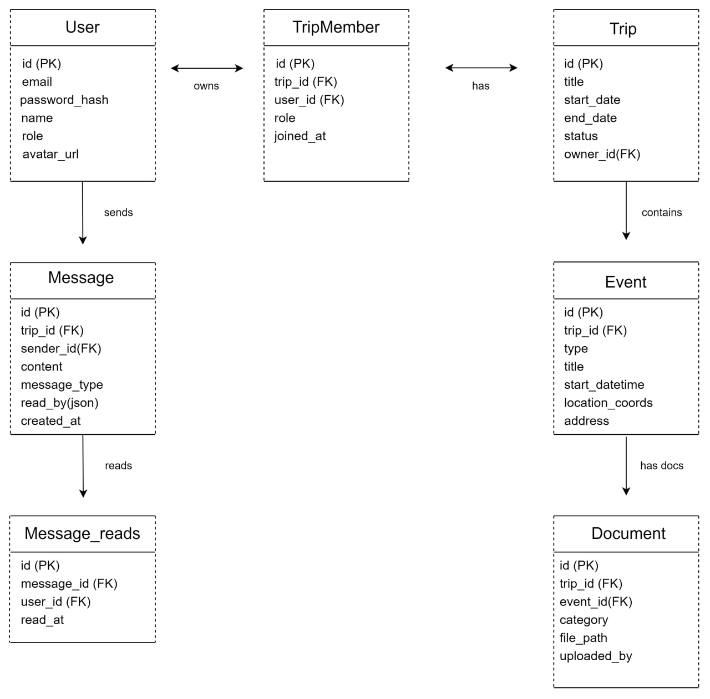
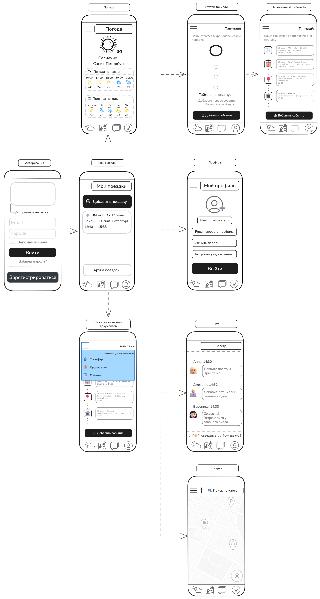

# 🧳 TripSync — Платформа для планирования путешествий

---

## 📋 Описание проекта

**TripSync** - это веб-сервис для планирования путешествий, который объединяет **маршруты, билеты, карты и общение** в одном пространстве. Приложение ориентировано на соло-путешественников, пары и компании друзей, позволяя синхронизировать планы любого масштаба **без хаоса в мессенджерах и почте**. Главная задача сервиса - **убрать разрозненность информации**: вместо того чтобы искать подтверждения бронирований в разных вкладках и дублировать договоренности в чатах, пользователь получает единую систему координации, где каждый этап поездки чётко структурирован и доступен в любой момент.

С точки зрения пользователя работа с приложением строится вокруг нескольких ключевых экранов. После регистрации пользователь попадает на экран **«Мои поездки»**, где видит карточки активных и завершённых путешествий и может создать новое. Внутри поездки открывается главный экран **«Таймлайн»**: сверху отображается блок **«Сегодня + ближайшее событие»**, а ниже по хронологии идут все этапы маршрута. Отдельно на этом же экране доступна **панель быстрого доступа** с тремя категориями (Flight/Trip, Hotel, Events), где документы сгруппированы по типу на весь период поездки - это позволяет за один клик найти нужный билет или бронь, не листая ленту.

Нижняя панель навигации всегда доступна и содержит четыре раздела:
1. **«Чат»** - общая переписка участников поездки, куда автоматически поступают системные напоминания о событиях («Завтра вылет в 14:00»), а статусы прочтения помогают видеть вовлечённость попутчиков.
2. **«Погода»** - виджет показывает актуальный прогноз в текущем городе пользователя; за неделю до вылета появляется возможность сравнить погоду «здесь» и «там», чтобы спланировать гардероб.
3. **«Карта»** - интерактивная карта города назначения с маркерами отеля, вокзалов и достопримечательностей, помогающая сориентироваться на месте.
4. **«Профиль»** - редактирование личных данных (имя, аватар), смена пароля, настройка частоты уведомлений и выход из аккаунта.

Ключевая ценность для пользователя - **спокойствие и контроль**. Приложение поддерживает **базовый офлайн-режим**: критичные данные маршрута и билеты **кэшируются локально**, а синхронизация происходит автоматически при появлении сети. Все загружаемые документы с паспортными данными **шифруются на сервере (AES-256)** перед сохранением в базу, что защищает личную информацию от несанкционированного доступа. Напоминания о событиях доставляются через **Web Push**. В результате пользователь тратит время на подготовку к путешествию и само путешествие, а не на поиск потерянных билетов или согласование планов в десятке мессенджеров.

---

## 👤 Основные пользовательские сценарии (User Stories)

### 🧳 Для Пользователя (User)
1. Как пользователь, я хочу видеть **список своих поездок**, чтобы быстро найти нужную.
2. Как пользователь, я хочу **добавлять участников поездки в чат**, чтобы синхронизировать планы в одном месте.
3. Как участник поездки, я хочу **переключаться между «Личным» и «Общим» таймлайном**, чтобы разделять личные дела и групповые планы.
4. Как пользователь, я хочу видеть **список событий в хронологическом порядке**, чтобы сразу видеть все свои планы.
5. Как пользователь, я хочу **добавлять документы**, чтобы хранить все в одном месте.
6. Как пользователь, я хочу иметь возможность **посмотреть погоду в городе назначения и отметить нужное место на карте**, чтобы не обращаться в другие приложения.

### 🛡 Для Администратора (Admin)
7. Как администратор, я хочу видеть **список всех пользователей платформы**, чтобы управлять доступом.
8. Как администратор, я хочу **блокировать нарушителей и удалять спам-поездки**, чтобы поддерживать порядок в системе.

---

## 🗂 Сущности системы и связи

| Сущность | Ключевые поля |
|----------|---------------|
| User | id, email, password_hash, name, role, avatar_url |
| Trip | id, title, start_date, end_date, status, owner_id |
| TripMember | id, trip_id, user_id, role (owner/member) |
| Event | id, trip_id, type (flight/hotel/event), title, start_datetime, location_coords |
| Document | id, trip_id, event_id (nullable), category, file_path_encrypted |
| Message | id, trip_id, sender_id, content, message_type (text/system), read_by |

### 🔗 Связи
- User ↔️ Trip: Many-to-Many (через TripMember)
- Trip → Event: One-to-Many
- Trip → Document: One-to-Many
- Event → Document: One-to-Many (опционально)
- Trip → Message: One-to-Many

## 🗄 ER-диаграмма



---

## 📱 Ключевые экраны и функциональность

| Экран | Что можно делать |
|-------|-------------------|
| Регистрация / Вход | Создать аккаунт, войти в профиль, восстановить пароль |
| Мои поездки | Видеть список активных/завершённых поездок, создать новую поездку |
| Таймлайн поездки | Видеть события в хронологии, добавлять/редактировать/удалять события, переключаться между общим и личным таймлайном |
| Панель документов | Добавлять документы по категориям (Flight/Hotel/Events), удалять файлы, быстрый доступ к билетам |
| Чат поездки | Общаться с участниками, получать системные уведомления о событиях, видеть статусы прочтения, приглашать новых участников |
| Погода | Отслеживать актуальный прогноз погоды |
| Карта | Отмечать на карте отель, места посещения, аэропорты и вокзалы для навигации |
| Профиль | Редактировать личные данные, менять аватар, сменить пароль, настроить уведомления, выйти из аккаунта |
| Админ-панель | Видеть список всех пользователей, блокировать нарушителей, удалять спам-поездки |

---

## 📸 Макет ключевых экранов


На макете представлены следующие экраны и состояния:

- **Погода** – прогноз по часам и на неделю для текущего города
- **Мои поездки** – список поездок (например, «Тюмень → Санкт-Петербург»), кнопка «Добавить поездку»
- **Таймлайн** – хронология событий (перелёт, встреча с друзьями, визит в Эрмитаж), панель документов (Трансфер, Проживание, События)
- **Пустой таймлайн** – состояние, когда событий еще нет, с предложением добавить первое событие
- **Профиль** – данные пользователя, кнопки «Редактировать профиль», «Сменить пароль», «Настроить уведомления», «Выйти»
- **Чат** – переписка участников поездки, поле ввода сообщения с кнопкой «Отправить»
- **Карта** – интерактивная карта с маркерами ключевых точек

---

## 📡 Список эндпоинтов API

Все эндпоинты используют базовый URL `/api`.
**Авторизация:** для всех защищённых эндпоинтов (кроме `/auth/*`) требуется JWT-токен, который передаётся в заголовке:
`Authorization: Bearer <token>`

### Auth (публичные)

| Метод | Эндпоинт | Вход (тело запроса) | Выход (успех) | Коды ошибок |
|-------|----------|----------------------|---------------|--------------|
| POST | `/auth/register` | `{ "email": "...", "password": "...", "name": "..." }` | `{ "user": { "id", "email", "name" } }` | 400, 409 |
| POST | `/auth/login` | `{ "email": "...", "password": "..." }` | `{ "user": { ... }, "token": "..." }` | 401 (неверные данные или email не подтверждён) |
| GET | `/auth/verify-email` | `?token=...` (query param) | `{ "message": "Email успешно подтвержден" }` | 400, 404 |
| GET | `/auth/me` | (токен в заголовке) | `{ "user": { ... } }` | 401 |

### Trips (требуют аутентификации)

| Метод | Эндпоинт | Вход | Выход |
|-------|----------|------|-------|
| GET | `/trips` | `?status=active` | `{ "trips": [...] }` |
| POST | `/trips` | `{ "title", "startDate", "endDate" }` | `{ "trip" }` |
| GET | `/trips/:id` | – | `{ "trip", "members", "events" }` |
| PUT | `/trips/:id` | `{ "title", "status" }` | `{ "trip" }` |
| DELETE | `/trips/:id` | – | `{ "message" }` |

### Events

| Метод | Эндпоинт | Вход | Выход |
|-------|----------|------|-------|
| POST | `/trips/:tripId/events` | `{ "type", "title", "startDateTime", "locationCoords" }` | `{ "event" }` |
| PUT | `/events/:eventId` | `{ "title", "startDateTime" }` | `{ "event" }` |
| DELETE | `/events/:eventId` | – | `{ "message" }` |

### Documents

| Метод | Эндпоинт | Вход | Выход |
|-------|----------|------|-------|
| POST | `/trips/:tripId/documents` | `form-data: file, category` | `{ "document" }` |
| GET | `/documents/:docId` | – | бинарный файл |
| DELETE | `/documents/:docId` | – | `{ "message" }` |

### Chat

| Метод | Эндпоинт | Вход | Выход |
|-------|----------|------|-------|
| GET | `/trips/:tripId/messages` | `?limit=50` | `{ "messages": [...] }` |
| POST | `/trips/:tripId/messages` | `{ "content" }` | `{ "message" }` |

### Weather

| Метод | Эндпоинт | Вход | Выход |
|-------|----------|------|-------|
| GET | `/weather` | `?city=...` | `{ "temp", "condition", "forecast" }` |

### Maps (2GIS)

| Метод | Эндпоинт | Вход | Выход |
|-------|----------|------|-------|
| GET | `/maps/search` | `?q=...` | `{ "places": [ { "name", "lat", "lng" } ] }` |

### Admin (role=admin)

| Метод | Эндпоинт | Вход | Выход |
|-------|----------|------|-------|
| GET | `/admin/users` | – | `{ "users": [...] }` |
| POST | `/admin/users/:id/block` | – | `{ "message" }` |
| DELETE | `/admin/trips/:id` | – | `{ "message" }` |

---

## 📁 Структура проекта
```text
tripsync/
├── frontend/                          # React + Vite + TypeScript
│   ├── public/                        # PWA manifest  (для офлайн-режима)
│   ├── src/
│   │   ├── pages/                     # Экраны приложения
│   │   │   ├── Auth/                  # Авторизация/регистрация
│   │   │   ├── Trips/                 # Мои поездки/добавить поездку
│   │   │   ├── TripDetail/            # Основной экран поездки (Таймлайн + Документы)
│   │   │   ├── Chat/                  # Экран чата поездки
│   │   │   ├── Map/                   # Интерактивная карта города
│   │   │   ├── Weather/               # Погода
│   │   │   ├── Profile/               # Редактирование профиля
│   │   │   └── Admin/                 # Админ-панель 
│   │   ├── components/       
│   │   │   ├── ui/                    # Button, Input, Modal, Card 
│   │   │   ├── layout/                # BottomNav, Header, ProtectedRoute
│   │   │   ├── Timeline/              # EventCard, TimelineGroup, AddEventModal
│   │   │   ├── Documents/             # DocumentUploader, EncryptedFileViewer
│   │   │   ├── Chat/                  # MessageBubble, ChatInput, SystemNotification
│   │   │   └── MapWidget/             # Компонент карты с маркерами
│   │   ├── stores/          
│   │   │   ├── useAuthStore.ts        # Авторизация
│   │   │   ├── useTripStore.ts        # Кэширование данных поездок (для офлайна)
│   │   │   ├── useChatStore.ts        # Сообщения и статусы прочтения
│   │   │   └── useOfflineStore.ts     # Статус сети и очередь синхронизации
│   │   ├── api/                       # Axios instance & endpoints
│   │   │   ├── client.ts              # Настройка interceptors (token refresh)
│   │   │   ├── auth.ts
│   │   │   ├── trips.ts
│   │   │   ├── documents.ts           # Загрузка/скачивание зашифрованных файлов
│   │   │   └── socket.ts              # WebSocket клиент для чата
│   │   ├── types/                     # TS Interfaces
│   │   │   ├── user.ts
│   │   │   ├── trip.ts
│   │   │   ├── event.ts
│   │   │   └── message.ts
│   │   ├── utils/                     # Helpers
│   │   │   ├── dateFormatter.ts
│   │   │   ├── geoUtils.ts            # Работа с координатами
│   │   │   └── encryption.ts          # Клиентская часть криптографии 
│   │   ├── hooks/                     # Custom hooks
│   │   │   ├── useGeoLocation.ts
│   │   │   └── usePushNotifications.ts # Web Push
│   │   ├── App.tsx
│   │   └── main.tsx
│   ├── package.json
│   └── vite.config.ts
│
├── backend/                           # Node.js + Express + TypeScript
│   ├── src/
│   │   ├── routes/                    # API Endpoints
│   │   │   ├── auth.routes.ts
│   │   │   ├── trips.routes.ts
│   │   │   ├── events.routes.ts
│   │   │   ├── documents.routes.ts
│   │   │   ├── chat.routes.ts
│   │   │   └── admin.routes.ts
│   │   ├── controllers/               # Request/Response handling
│   │   │   ├── auth.controller.ts
│   │   │   ├── trip.controller.ts
│   │   │   ├── document.controller.ts # Логика приема файлов
│   │   │   └── admin.controller.ts
│   │   ├── services/                  # Business Logic
│   │   │   ├── auth.service.ts
│   │   │   ├── trip.service.ts
│   │   │   ├── event.service.ts
│   │   │   ├── document.service.ts    # Шифрование AES-256 перед сохранением
│   │   │   ├── chat.service.ts        # Логика сообщений
│   │   │   ├── weather.service.ts     # Интеграция с внешним API погоды
│   │   │   └── notification.service.ts# Web Push & Email рассылки
│   │   ├── middleware/                # Express Middleware
│   │   │   ├── auth.middleware.ts     # Проверка JWT
│   │   │   ├── role.middleware.ts     # Проверка ролей (Admin/User)
│   │   │   ├── upload.middleware.ts   # Multer config для файлов
│   │   │   └── validation.middleware.ts
│   │   ├── websocket/                 # WebSocket Server
│   │   │   ├── ws.server.ts           # Инициализация WS
│   │   │   └── chat.handler.ts        # Обработка событий чата (join, message, read)
│   │   ├── prisma/                    # Database
│   │   │   ├── schema.prisma          # ERD: User, Trip, Event, Document, Message
│   │   │   └── seed.ts                # Начальные данные (тестовые пользователи)
│   │   ├── utils/                     # Helpers
│   │   │   ├── crypto.ts              # Утилиты шифрования/дешифрования 
│   │   │   ├── logger.ts
│   │   │   └── errorHandling.ts
│   │   ├── app.ts                     # Настройка Express
│   │   └── server.ts                  # Точка входа (HTTP + WS)
│   ├── Dockerfile
│   ├── package.json
│   └── tsconfig.json
│
├── docker-compose.yml                 # Оркестрация: DB, Backend, Frontend, Redis
├── .env.example
└── README.md
```

---

## 🗺 План действий

### Общая диаграмма (Gantt-стиль)

```
Неделя  │ 1  │ 2  │ 3  │ 4  │ 5  │ 6  │ 7  │ 8  │
───────────────────────────────────────────────────
Проект. │████│    │    │    │    │    │    │    │
Фронтенд│░░░░│████│████│    │    │    │    │    │
Бэкенд  │    │    │    │████│████│    │    │    │
Интеграц│    │    │    │    │    │████│████│    │
Финал   │    │    │    │    │    │    │    │████│

████ — активная разработка    ░░░░ — старт / подготовка
```

### Детальный план по блокам

#### 1. Проектирование *(до 12 мая)*

- [x] Описание идеи и целевой аудитории
- [x] User stories для ролей User и Admin
- [x] Список сущностей и связей
- [x] Список ключевых экранов
- [x] План работ (Roadmap)

#### 2. Frontend — Каркас и UI *(до 20 мая)*

- [ ] Инициализация проекта (Vite + React + TypeScript)
- [ ] Настройка роутинга и Layout
- [ ] Базовые UI‑компоненты (Button, Input, Card)
- [ ] Вёрстка экранов‑заглушек (Login, MyTrips, Timeline, Chat)

#### 3. Backend — Ядро *(до 5 июня)*

- [ ] Инициализация сервера (Node.js + Express)
- [ ] Подключение Prisma ORM + PostgreSQL
- [ ] Схема БД и миграции
- [ ] Auth: регистрация, логин, JWT
- [ ] CRUD API: Trips, Events, Members, Documents, Messages

#### 4. Frontend — Интеграция с API *(до 20 июня)*

- [ ] Подключение Axios и настройка авторизации
- [ ] Реальная загрузка данных поездок и событий
- [ ] Работа чата и документов
- [ ] Логика переключения таймлайнов

#### 5. Фичи и Внешние API *(до 27 июня)*

- [ ] Интеграция Weather API и Maps API
- [ ] Web Push‑уведомления
- [ ] Админ‑панель (управление пользователями)
- [ ] Обработка ошибок и полировка UI

#### 6. Финализация *(до 1 июля)*

- [ ] Docker Compose сборка
- [ ] Тестовые данные (seed)
- [ ] Финальный README и инструкция запуска
- [ ] Подготовка презентации и демо

---